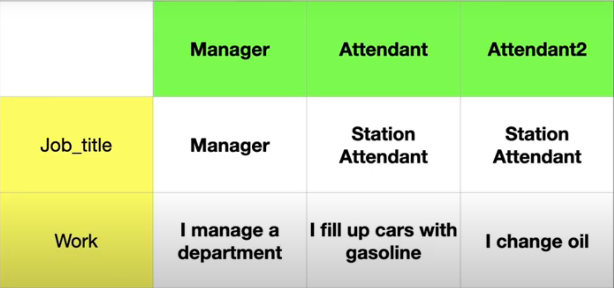
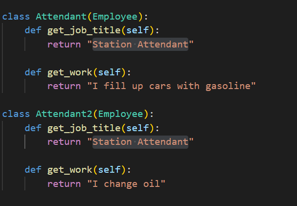

# Now we add a second attendant class   
# The job_title is also Station Attendant but this attendant makes "oil changes "

# But again there is duplicate

# To make it worse , lets add another employee type that create even more duplicate code , check 04. code_modification.py
