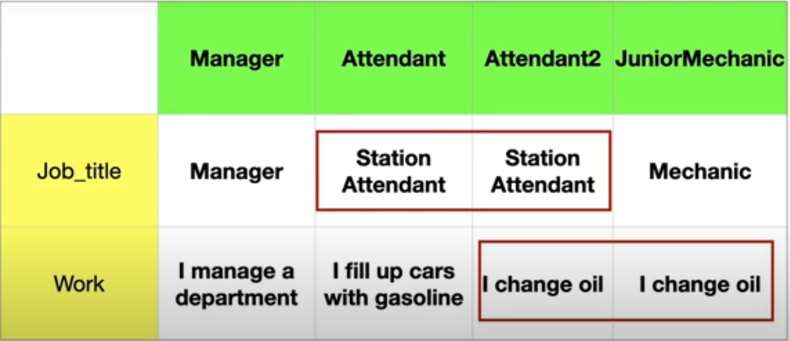
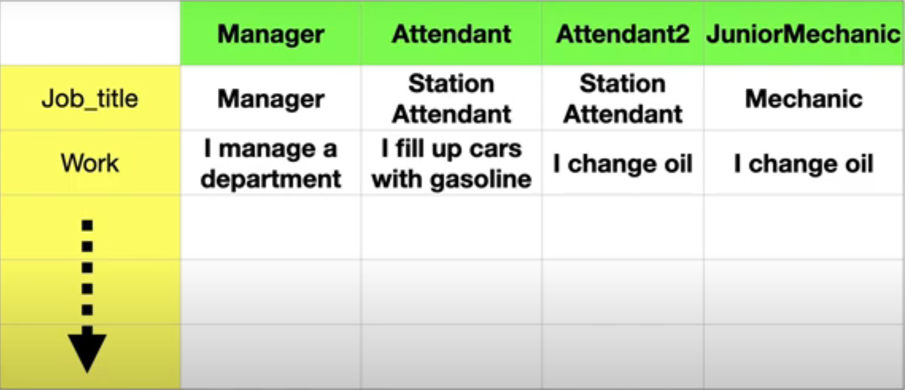
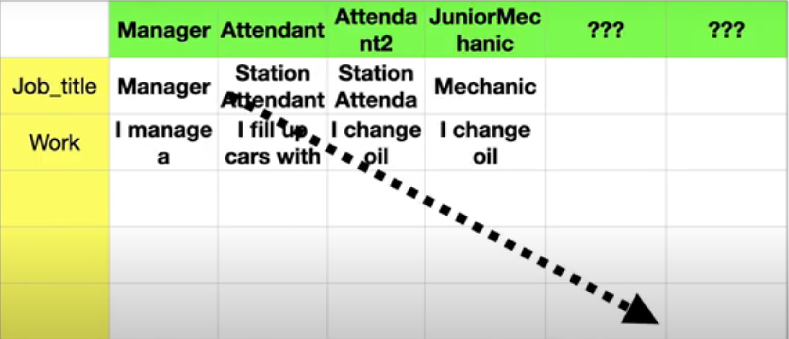

# In the code we can now see there is lot more duplicate code
# Lets see with the help of matrix

# Now image adding more attribute

# The combinations of things grows exponentially. And for each combination, a new class needs to be introduced adding more duplicate code. Hence this is not the way to go.

# So use STRATEGY PATTERN to solve this well know problem