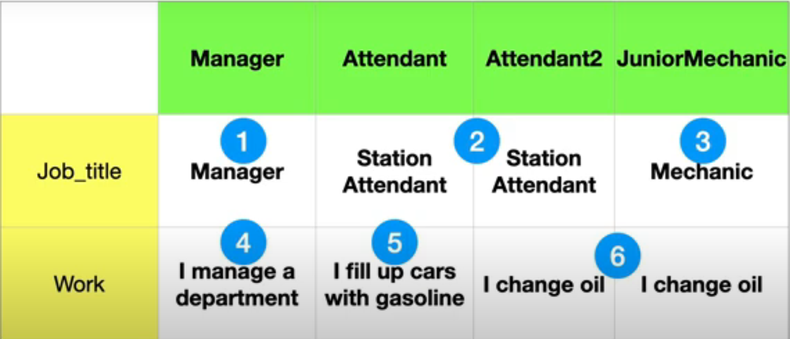
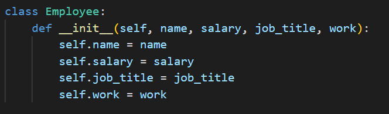
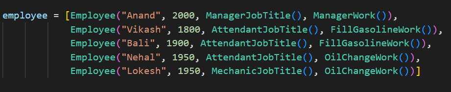

# Strategy Pattern
In strategy pattern the code that returns a value in cells are called algorithms.

Lets see this example in matrix.

Here in this example we can see six unique algorithms , the strategy pattern puts all these algorithms in seperate classes. Once the algorithm have been put in classes, instances of algorithm classes will be assigned to employee by using composition. 

The strategy pattern really gives us the flexibility to combine algorithms at runtime. Without adding any employee subclass , we can now create employee types at run-time.

